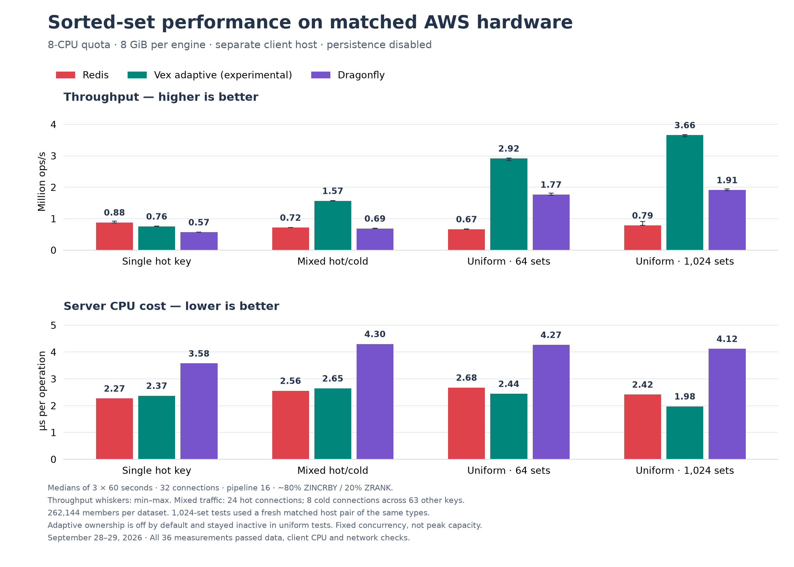

# Sorted-set benchmarks: Vex, Redis and Dragonfly

[Back to README](../README.md) · [Pitch and benchmark package](benchmarks/2026-09-29/README.md)

**3.66 million sorted-set operations per second with an eight-CPU allocation.**
Vex's experimental adaptive configuration led mixed hot/cold and uniform
throughput in this matched AWS comparison. Redis led the single-hot-key test.

All engines received an **8-CPU quota and 8 GiB**, persistence disabled, with
identical client settings on a separate host. Numbers are medians of three
60-second measurements. All **36 measured trials** passed verification.

## Throughput

Millions of operations per second; higher is better.

| Workload | Redis | Vex adaptive | Dragonfly |
|---|---:|---:|---:|
| Single hot key | 0.882 | 0.756 | 0.570 |
| Mixed hot/cold | 0.718 | 1.569 | 0.689 |
| Uniform, 64 sets | 0.667 | 2.919 | 1.769 |
| Uniform, 1,024 sets | 0.787 | 3.660 | 1.912 |

For the 1,024-set workload, Vex delivered **4.65× Redis throughput and 1.91×
Dragonfly throughput**. For mixed hot/cold traffic, the ratios were **2.18×**
and **2.28×**, respectively. These ratios apply to the named workloads at the
tested client settings.

## CPU efficiency

Server CPU microseconds per operation; lower is better.

| Workload | Redis | Vex adaptive | Dragonfly |
|---|---:|---:|---:|
| Single hot key | 2.27 | 2.37 | 3.58 |
| Mixed hot/cold | 2.56 | 2.65 | 4.30 |
| Uniform, 64 sets | 2.68 | 2.44 | 4.27 |
| Uniform, 1,024 sets | 2.42 | 1.98 | 4.12 |

Vex used **52% less CPU time per operation than Dragonfly** in the 1,024-set
workload. Redis remained slightly cheaper per operation for hot and mixed
traffic. CPU time per operation does not directly establish cloud cost savings.

## What was tested

- Approximately 80% ZINCRBY / 20% ZRANK, 32 connections, pipeline 16.
- 262,144 preloaded members: 64 × 4,096 or 1,024 × 256.
- Mixed traffic: 24 hot connections and 8 cold connections across 63 other keys.
- Eight-CPU cgroup quota on a c6gn.8xlarge server; separate c7g.16xlarge client.
- Redis 8.10.1, Dragonfly 2.0.0-40553fd842c2850b65787ed4da908d95aeab8834,
  and a frozen experimental Vex build; image and executable hashes checked.
- Exact-data, client CPU and network allowance checks; raw evidence retained.

**Adaptive ownership is experimental and off by default.** It activated for
hot and mixed traffic and stayed inactive for uniform traffic. Uniform results
are not attributed to hot-key routing. The 1,024-set comparison reran all three
engines on a fresh matched host pair after the original hosts expired.

These are fixed-concurrency measurements, not a saturation sweep. Latency in
the detailed report is **pipeline round-trip p99**, not per-command service
latency. Short synthetic tests do not establish production durability,
long-duration behavior, GET/SET performance or universal superiority.

[Full methodology, latency and trial ranges](adaptive-three-engine-aws-2026-09-28.md) ·
[CSV](benchmarks/2026-09-29/results.csv) · [JSON](benchmarks/2026-09-29/results.json) ·
[Reproduce](benchmarks/2026-09-29/reproduce.md)
